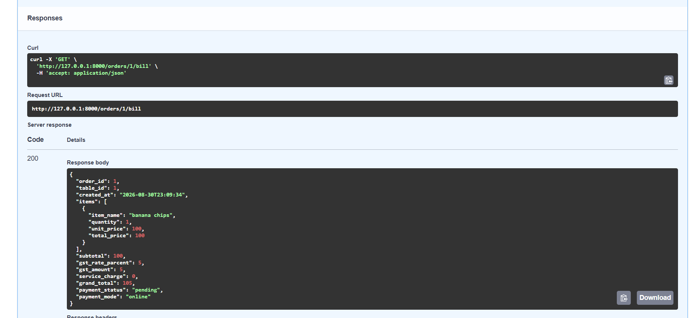
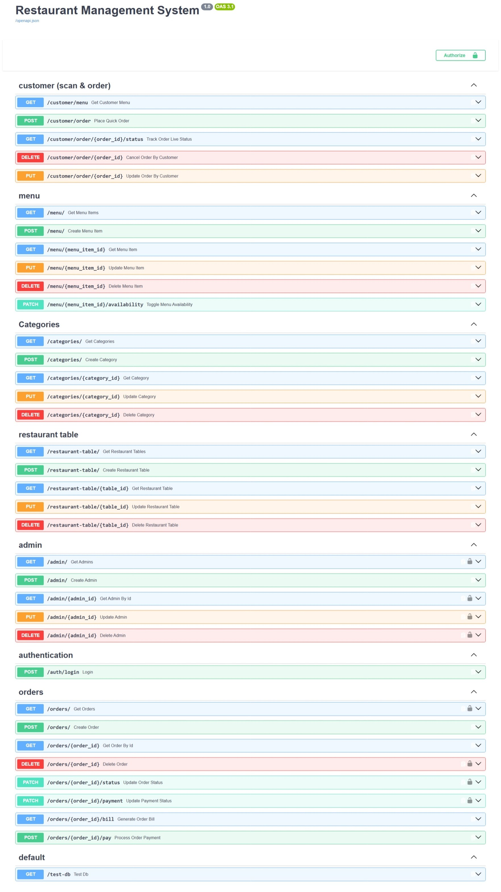
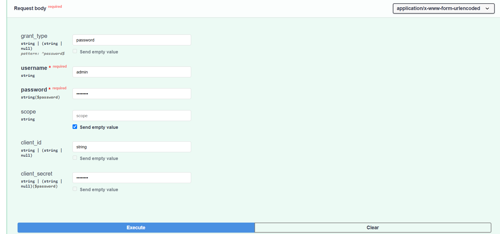
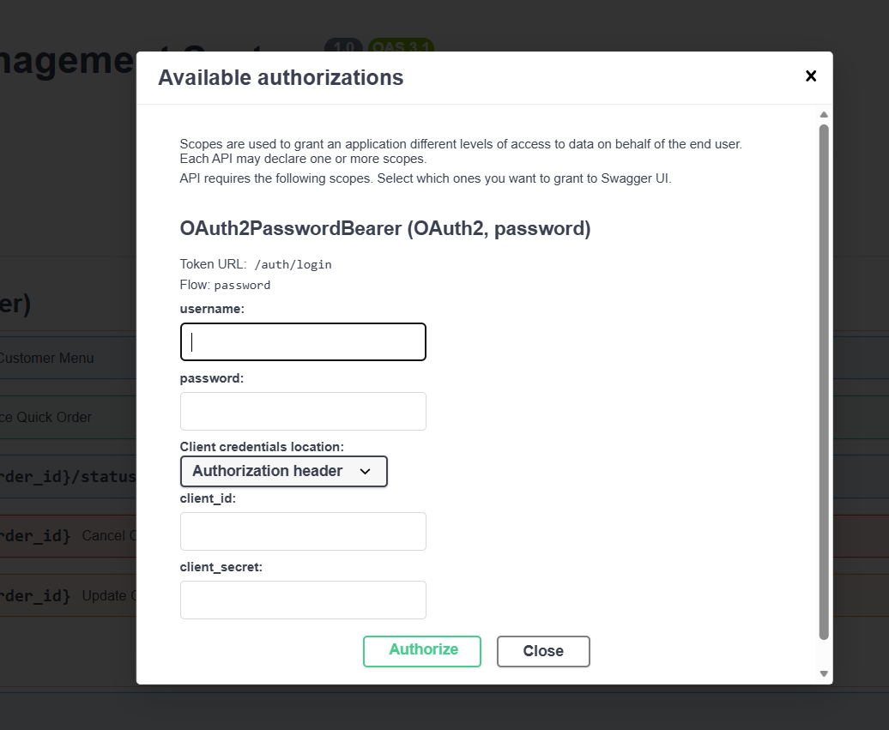
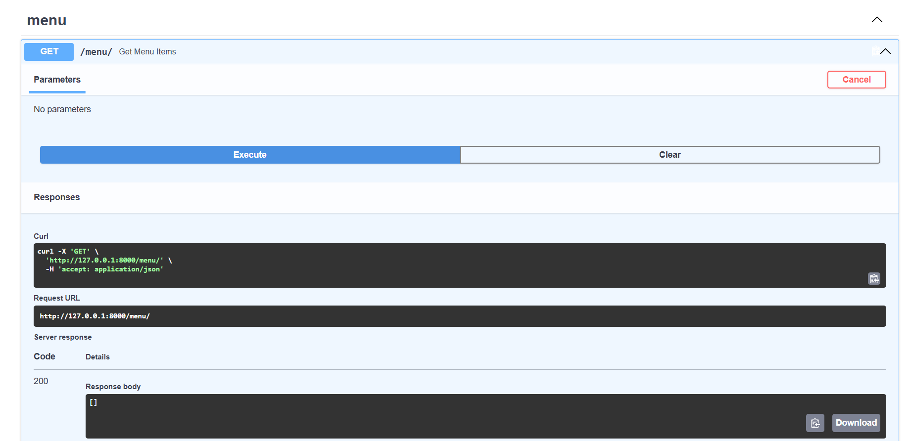
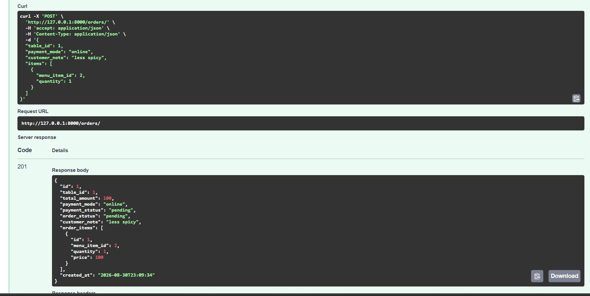
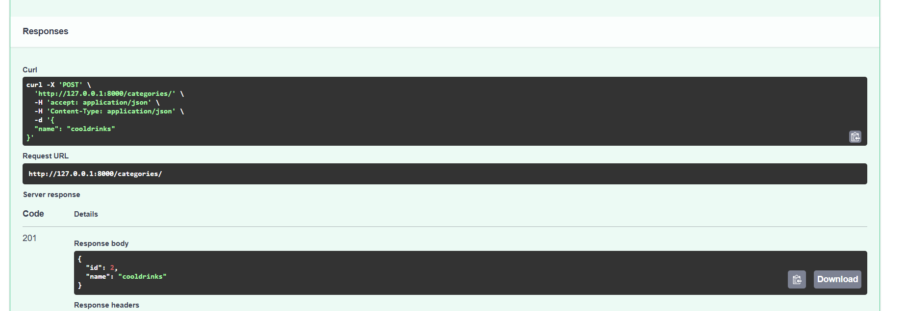
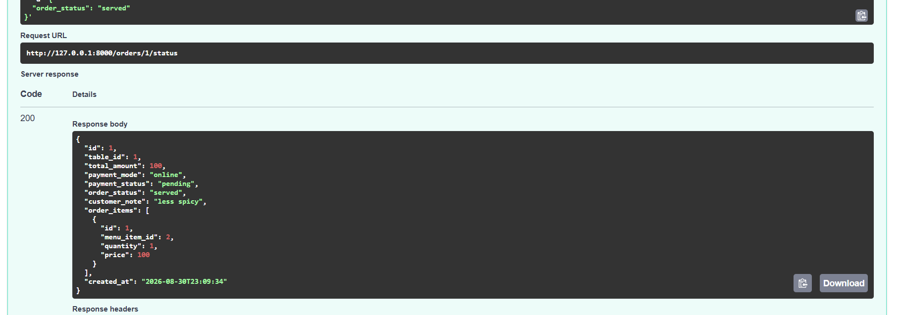

# 🍽️ Restaurant Management System — FastAPI Backend

A backend-focused **Restaurant Management System REST API** built with **FastAPI, SQLAlchemy, MySQL, JWT Authentication, and WebSockets**.

This project provides APIs for restaurant menu management, categories, restaurant tables, customer ordering, order management, payment status, billing, admin authentication, and real-time kitchen order notifications.

> **Project Type:** Backend API
> **Primary Focus:** FastAPI Backend Development
> **Database:** MySQL
> **API Documentation:** Swagger UI / OpenAPI

---

## 📌 Project Overview

The Restaurant Management System is designed as a backend API for managing the core operations of a restaurant.

The system supports two major sides:

* **Customer Side**

  * View available menu items
  * Place orders
  * Track order status
  * Modify orders within a limited time
  * Cancel pending orders within a limited time

* **Admin / Restaurant Side**

  * Manage categories
  * Manage menu items
  * Manage restaurant tables
  * Manage orders
  * Update order status
  * Update payment status
  * Generate bills
  * Manage admin accounts
  * Receive real-time new-order notifications through WebSockets

The project is intentionally maintained as a **backend-only application**. No frontend framework is included in the repository.

---

## ✨ Features

### 🔐 Authentication & Authorization

* Admin login using OAuth2 password flow
* JWT access token generation
* JWT token verification
* Protected admin/order management endpoints
* Password hashing using bcrypt
* Token expiration support
* Bearer token authentication

---

### 📂 Category Management

Admin APIs for:

* Create category
* Get all categories
* Get category by ID
* Update category
* Delete category

---

### 🍕 Menu Management

Menu item APIs for:

* Create menu item
* Get all menu items
* Get menu item by ID
* Update menu item
* Delete menu item
* Toggle menu item availability
* Category-based menu relationships
* Vegetarian/non-vegetarian support
* Price and description management

---

### 🪑 Restaurant Table Management

Table APIs for:

* Create restaurant table
* Get all tables
* Get table by ID
* Update table
* Delete table
* Activate/deactivate restaurant tables
* QR-code field support

---

### 🛒 Customer Ordering

Customer APIs allow users to:

* View only available menu items
* Place an order
* Select a restaurant table
* Select payment mode
* Add multiple menu items
* Specify item quantities
* Add customer notes
* Track order status
* Modify an order within 5 minutes
* Cancel a pending order within 5 minutes

---

### 📦 Order Management

Order APIs support:

* Create order
* Get all orders
* Get order by ID
* Update order status
* Update payment status
* Delete order
* Generate order bill
* Calculate subtotal
* Calculate GST
* Calculate grand total

Supported order statuses:

```text
pending
preparing
served
cancelled
```

Supported payment statuses:

```text
pending
paid
failed
refunded
```

Supported payment modes:

```text
cash
online
```

---

### 💳 Payment Flow

The backend supports payment status management.

Current payment modes:

* Cash
* Online

The system can update an order as paid and mark the order as served through the payment endpoint.

---

### 🧾 Billing

The billing API calculates:

* Order items
* Quantity
* Unit price
* Item total
* Subtotal
* GST
* Grand total
* Payment status
* Payment mode

The current GST rate implemented in the backend is:

```text
5%
```

---

### ⚡ Real-Time Kitchen Notifications

The project includes a WebSocket-based kitchen notification system.

When a customer places an order:

```text
Customer
   ↓
POST /customer/order
   ↓
Order Service
   ↓
MySQL Database
   ↓
WebSocket Manager
   ↓
Kitchen Clients
```

Connected kitchen clients receive a real-time notification when a new order is created.

WebSocket endpoint:

```text
/ws/kitchen
```

---

## 🏗️ Architecture

The backend follows a layered structure:

```text
Client
   │
   ▼
FastAPI Router
   │
   ▼
Service Layer
   │
   ▼
CRUD Layer
   │
   ▼
SQLAlchemy ORM
   │
   ▼
MySQL Database
```

### Main responsibilities

**Routers**

Handle HTTP/WebSocket requests and responses.

**Services**

Contain business logic, especially order creation and order status operations.

**CRUD**

Handles database operations.

**Models**

Define SQLAlchemy database models and relationships.

**Schemas**

Define request/response validation using Pydantic.

**Utils**

Handle authentication, JWT tokens, and password security.

---

## 🗂️ Project Structure

```text
restorent-managment/
│
├── app/
│   │
│   ├── routers/
│   │   ├── admin.py
│   │   ├── category.py
│   │   ├── customer.py
│   │   ├── menu.py
│   │   ├── order.py
│   │   ├── restorenttable.py
│   │   └── websocket.py
│   │
│   ├── services/
│   │   └── order_service.py
│   │
│   ├── config.py
│   ├── crud.py
│   ├── database.py
│   ├── main.py
│   ├── models.py
│   └── schemas.py
│
├── utils/
│   ├── auth.py
│   └── security.py
│
├── database.sql
├── requirements.txt
├── .env.example
├── .gitignore
└── README.md
```

---

## 🛠️ Tech Stack

| Technology    |  Purpose         |
 -------------------------------   |
| Python        | Backend     programming|
| FastAPI       | REST API framework|
| Pydantic      | Data validation |
| SQLAlchemy    | ORM / database interaction|
| MySQL         | Relational database |
| PyMySQL       | MySQL database driver|
| JWT           | Authentication    |
| bcrypt        | Password hashing  |
| WebSockets    | Real-time kitchen notifications|
| Uvicorn       | ASGI server       |
| python-dotenv | Environment configuration |

---

## 🗄️ Database Design

The project uses MySQL with the following main tables:

```text
admins
categories
restaurant_tables
menu_items
orders
order_items
```

### Relationships

```text
categories
     │
     ▼
menu_items
     │
     ▼
order_items
     ▲
     │
orders
     │
     ▼
restaurant_tables
```

### Admin

Stores administrator accounts.

```text
id
username
password
created_at
```

### Categories

Stores food categories.

```text
id
name
```

### Restaurant Tables

Stores restaurant table information.

```text
id
table_number
qr_code
is_active
```

### Menu Items

Stores restaurant menu items.

```text
id
category_id
name
description
price
image
is_veg
available
created_at
```

### Orders

Stores customer orders.

```text
id
table_id
total_amount
payment_mode
payment_status
order_status
customer_note
created_at
updated_at
```

### Order Items

Stores individual items belonging to an order.

```text
id
order_id
menu_item_id
quantity
price
```

---

## 🔌 API Endpoints

### Authentication

| Method | Endpoint      | Description                          |
| ------ | ------------- | ------------------------------------ |
| POST   | `/auth/login` | Admin login and JWT token generation |

---

### Admin

| Method | Endpoint            | Description     |
| ------ | ------------------- | --------------- |
| POST   | `/admin/`           | Create admin    |
| GET    | `/admin/`           | Get all admins  |
| GET    | `/admin/{admin_id}` | Get admin by ID |
| PUT    | `/admin/{admin_id}` | Update admin    |
| DELETE | `/admin/{admin_id}` | Delete admin    |

---

### Categories

| Method | Endpoint                    | Description        |
| ------ | --------------------------- | ------------------ |
| POST   | `/categories/`              | Create category    |
| GET    | `/categories/`              | Get all categories |
| GET    | `/categories/{category_id}` | Get category       |
| PUT    | `/categories/{category_id}` | Update category    |
| DELETE | `/categories/{category_id}` | Delete category    |

---

### Menu

| Method | Endpoint | Description |
| ------ | ----------------------------------- | ------------------- |
| POST   | `/menu/` |Create menu item  |
| GET    | `/menu/` | Get all menu items  |
| GET    |`/menu/{menu_item_id}`|Get menu item |
| PUT    |`/menu/{menu_item_id}|Update menu item |
| DELETE | `/menu/{menu_item_id}|Delete menu item|
| PATCH  | `/menu/{menu_item_id}/availability` Toggle availability|

---

### Restaurant Tables

| Method | Endpoint                       | Description    |
| ------ | ------------------------------ | -------------- |
| POST   | `/restaurant-table/`           | Create table   |
| GET    | `/restaurant-table/`           | Get all tables |
| GET    | `/restaurant-table/{table_id}` | Get table      |
| PUT    | `/restaurant-table/{table_id}` | Update table   |
| DELETE | `/restaurant-table/{table_id}` | Delete table   |

---

### Customer

| Method | Endpoint                            | Description          |
| ------ | ----------------------------------- | -------------------- |
| GET    | `/customer/menu`                    | Get available menu   |
| POST   | `/customer/order`                   | Place customer order |
| GET    | `/customer/order/{order_id}/status` | Track order          |
| PUT    | `/customer/order/{order_id}`        | Modify order         |
| DELETE | `/customer/order/{order_id}`        | Cancel order         |

---

### Orders

| Method | Endpoint                     | Description           |
| ------ | ---------------------------- | --------------------- |
| POST   | `/orders/`                   | Create order          |
| GET    | `/orders/`                   | Get all orders        |
| GET    | `/orders/{order_id}`         | Get order             |
| PATCH  | `/orders/{order_id}/status`  | Update order status   |
| PATCH  | `/orders/{order_id}/payment` | Update payment status |
| DELETE | `/orders/{order_id}`         | Delete order          |
| GET    | `/orders/{order_id}/bill`    | Generate bill         |
| POST   | `/orders/{order_id}/pay`     | Process payment       |

---

### WebSocket

```text
/ws/kitchen
```

Used for real-time kitchen order notifications.

---

## 📖 API Documentation

FastAPI automatically provides interactive API documentation.

After starting the server, open:

```text
http://127.0.0.1:8000/docs
```

Swagger UI can be used to:

* Explore API endpoints
* Send requests
* Test request bodies
* Test authentication
* View response schemas
* Check HTTP status codes



## ⚙️ Installation & Setup

### 1. Clone the repository

```bash
git clone <your-github-repository-url>
cd restorent-managment
```

---

### 2. Create a virtual environment

```bash
python -m venv venv
```

Activate it on Windows:

```bash
venv\Scripts\activate
```

---

### 3. Install dependencies

```bash
pip install -r requirements.txt
```

---

### 4. Configure environment variables

Create a `.env` file in the project root.

Use `.env.example` as a template:

```env
DB_HOST=localhost
DB_PORT=3306
DB_USER=your_username
DB_PASSWORD=your_password
DB_NAME=your_database

SECRET_KEY=your_secret_key
ALGORITHM=HS256
ACCESS_TOKEN_EXPIRE_MINUTES=30
```

> Never commit the real `.env` file to GitHub.

---

### 5. Setup MySQL

Create the database and tables using:

```text
database.sql
```

The database contains:

```text
admins
categories
restaurant_tables
menu_items
orders
order_items
```

---

### 6. Start the server

```bash
uvicorn app.main:app --reload
```

Server:

```text
http://127.0.0.1:8000
```

Swagger:

```text
http://127.0.0.1:8000/docs
```

---

## 🔑 Authentication Flow

The authentication flow works using JWT.

```text
Admin
  │
  │ username + password
  ▼
POST /auth/login
  │
  ▼
Verify credentials
  │
  ▼
Generate JWT
  │
  ▼
Access protected endpoints
```

For protected endpoints, send:

```text
Authorization: Bearer <access_token>
```


---

## 📡 API Examples

### 🍽️ Menu API

The Menu API provides restaurant menu items with category, pricing, availability, and vegetarian information.



### 🛒 Order Creation

Customers can create orders by selecting a restaurant table and menu items.



### 📂 Category API

The Category API provides CRUD operations for restaurant food categories.




### Order Status Management

Administrators can update an order through different states such as pending, preparing, served, and cancelled.




## 🛒 Order Flow

A typical customer order flow:

```text
1. Customer views menu
        ↓
2. Customer selects table
        ↓
3. Customer selects menu items
        ↓
4. Customer places order
        ↓
5. Order is stored in MySQL
        ↓
6. Total amount is calculated
        ↓
7. Kitchen receives WebSocket notification
        ↓
8. Admin updates order status
        ↓
9. Payment status is updated
        ↓
10. Bill can be generated
```

---

## ⏱️ Customer Order Rules

The backend implements a **5-minute modification/cancellation window**.

### Cancel order

A customer can cancel an order when:

```text
Order status = pending
AND
Order age <= 5 minutes
```

### Modify order

A customer can modify order items when:

```text
Order status = pending
AND
Order age <= 5 minutes
```

Once the kitchen starts preparing the order, modification/cancellation is rejected.

---

## ⚡ WebSocket Flow

```text
Customer places order
        │
        ▼
POST /customer/order
        │
        ▼
Order Service
        │
        ├── Validate table
        ├── Validate menu items
        ├── Calculate total
        └── Save order
        │
        ▼
WebSocket Manager
        │
        ▼
Connected Kitchen Clients
        │
        ▼
New Order Notification
```

<!-- SCREENSHOT 2: WebSocket / kitchen notification testing goes here -->

---

## 🧪 Testing APIs with Swagger

The project can be tested directly using FastAPI Swagger UI.

Recommended testing sequence:

```text
1. Create admin
2. Login
3. Copy JWT token
4. Authorize in Swagger
5. Create categories
6. Create menu items
7. Create restaurant tables
8. Place customer order
9. View orders
10. Update order status
11. Update payment status
12. Generate bill
```

<!-- SCREENSHOT 3: Swagger Authorize / JWT token goes here -->

---

## 📊 Example Order Request

```json
{
  "table_id": 1,
  "payment_mode": "cash",
  "customer_note": "Less spicy",
  "items": [
    {
      "menu_item_id": 1,
      "quantity": 2
    }
  ]
}
```

---

## 📊 Example Order Response

```json
{
  "id": 1,
  "table_id": 1,
  "total_amount": 300.0,
  "payment_mode": "cash",
  "payment_status": "pending",
  "order_status": "pending",
  "customer_note": "Less spicy",
  "order_items": [],
  "created_at": "2026-01-01T12:00:00"
}
```

---

## 🔒 Security

The project implements:

* JWT authentication
* Bearer token authorization
* bcrypt password hashing
* Environment variables for sensitive configuration
* Pydantic request validation
* Protected admin order-management endpoints

Sensitive configuration is intentionally excluded from GitHub using:

```text
.env
```

and `.gitignore`.

---

## 📁 Environment Configuration

The repository contains:

```text
.env.example
```

instead of the real `.env`.

Example:

```env
DB_HOST=localhost
DB_PORT=3306
DB_USER=your_username
DB_PASSWORD=your_password
DB_NAME=your_database

SECRET_KEY=your_secret_key
ALGORITHM=HS256
ACCESS_TOKEN_EXPIRE_MINUTES=30
```

---

## 🧠 Backend Concepts Demonstrated

This project demonstrates practical experience with:

* REST API development
* FastAPI routing
* Dependency injection
* Pydantic validation
* SQLAlchemy ORM
* MySQL relational database design
* CRUD operations
* Foreign key relationships
* Database transactions
* JWT authentication
* Password hashing
* OAuth2 password flow
* Service layer architecture
* WebSockets
* Real-time notifications
* Business logic validation
* HTTP status codes
* Environment configuration
* API documentation with Swagger/OpenAPI

---

## 🚀 Future Improvements

Possible future improvements include:

* Frontend client application
* Role-based authorization
* Production payment gateway integration
* Automated testing with Pytest
* Database migrations with Alembic
* Docker containerization
* Production deployment
* Better WebSocket connection handling
* Pagination and filtering
* Restaurant analytics dashboard
* Order history and reporting
* Automated QR-code generation

---

## 🎯 Project Purpose

This project was built to practice and demonstrate **real-world backend development using FastAPI**.

The main focus is on:

```text
API Design
+
Database Design
+
Authentication
+
Business Logic
+
Real-Time Communication
```

The repository intentionally focuses on the **backend/API layer** rather than frontend development.

---

## 👨‍💻 Developer

**Vishal Kumar Joshi**

Python Developer | Backend Developer | AI/ML Enthusiast

---

## ⭐ Project Highlights

```text
FastAPI
SQLAlchemy
MySQL
JWT Authentication
bcrypt
REST APIs
CRUD
Service Layer
Order Management
Payment Management
Billing
WebSockets
Real-Time Kitchen Notifications
Swagger / OpenAPI
```

If you find this project useful, consider giving the repository a ⭐.
